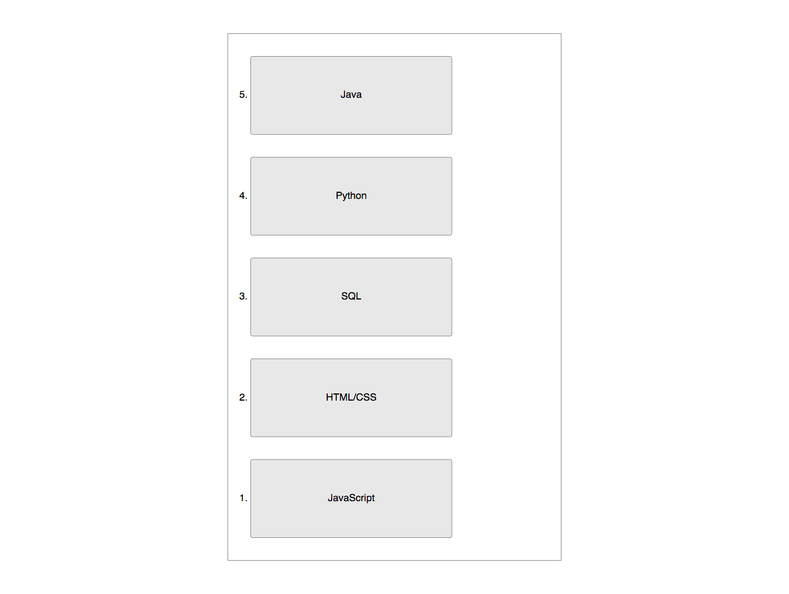
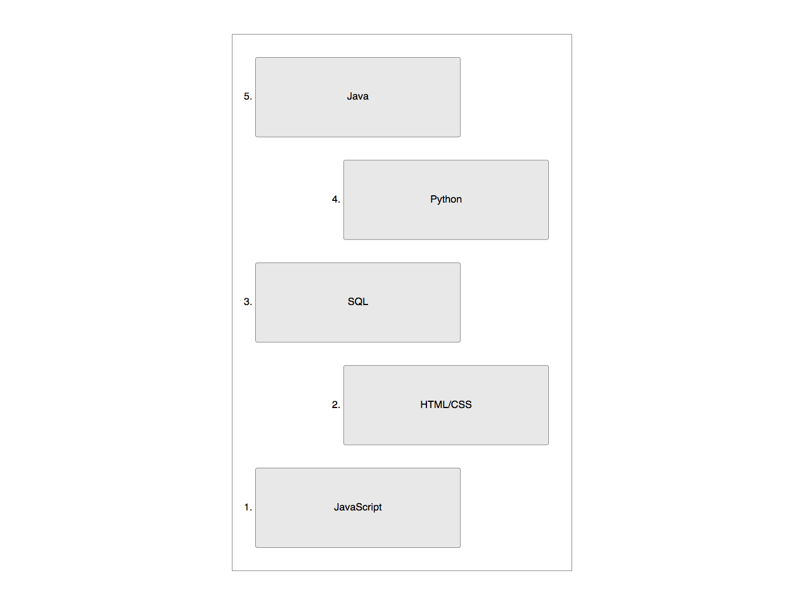
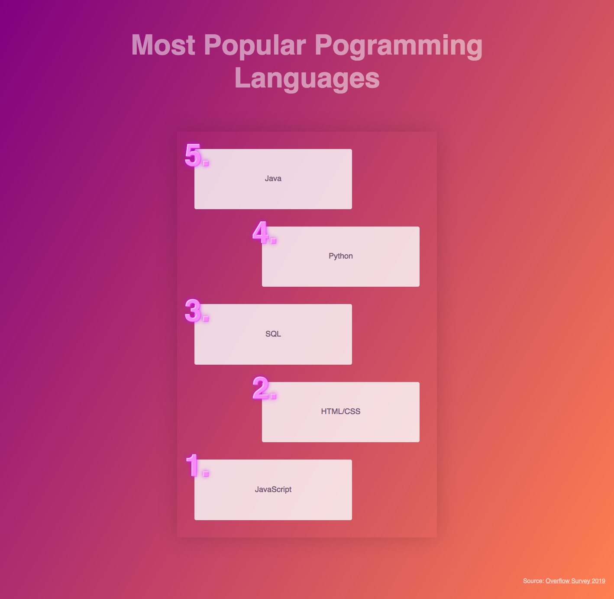

# TOP 5 most popular list

Let's create a list of the top 5 most popular programming languages according to the [Stack Overflow’s annual Developer Survey](https://insights.stackoverflow.com/survey/2019#most-popular-technologies).

## Step 1

- [x] Create a list (using semantic HTML)
- [x] Order items from last to first via CSS (in the HTML order remain from first to last)
- [x] List items expand beyond their content, but not to the full width of the parent container

Take a look at the example:

## Step 2

- [x] Container remains centered on the page
- [x] Every other list item is aligned to the opposite edge of the container

Take a look at the example:

## Extra

- [] Use custom counter
- [] Style custom counter (there is color, text shadow, larger font size and weight)
- [] Numbers appear a little out of the box
- [] Add gradient
- [] Add a link to the source
- [] Text color is a shade of gray
- [] Add headline

Take a look at the example:

